# Strava Bridge

Strava is a popular social-fitness network that enables its users to track and share their exercise activities. You can stream your fitness data from Strava to Quix seamlessly as the data is synced from your fitness devices to Strava.

## Why connect your Strava to Quix?

Strava allows you to keep track of and manage your fitness activities. With Quix you can build a distributed network of computational models to perform complex analytics on your data. Quix will allow you to experience the power of your fitness data in its full force.

In this example, we are going to build and deploy a service that injests data from Strava to Quix streams continously. This guide assumes that you already have a Strava account and Quix workspace. Otherwise, you can create a Strava account at [Strava](https://www.strava.com/) and sign up for a Quix account at [Quix.ai](https://quix.ai).

## Register an API application on Strava

For Quix to be able to connect to Strava, we first need to register and authorise Quix in Strava settings. If you do not already have an app registered, after you logon to your Strava account, navigate to [Settings](https://www.strava.com/settings/api) and create a new API application as described in section B of [Strava API documentation](https://developers.strava.com/docs/getting-started/). Below is an example of a Strava API application.

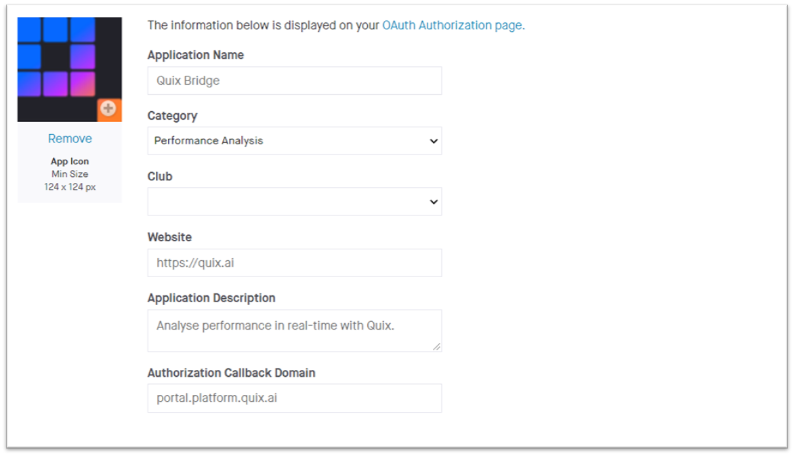

The only setting on the app creation form that is important to us is the _Authorization Callback Domain_. You can use any domain here like `localhost` or `portal.platform.quix.ai` and take note of that as we are going to use it later. The rest of the properties have no bearing on our application.

## Obtain credentials for Strava

Strava APIs use OAuth 2.0 authentication and support authorisation code and refresh token flows. Therefore, to connect to Strava you need a client id, client secret and a refresh token. You can find the client id and secret for the application we created in the preceding section on the [My API Application](https://www.strava.com/settings/api) page:

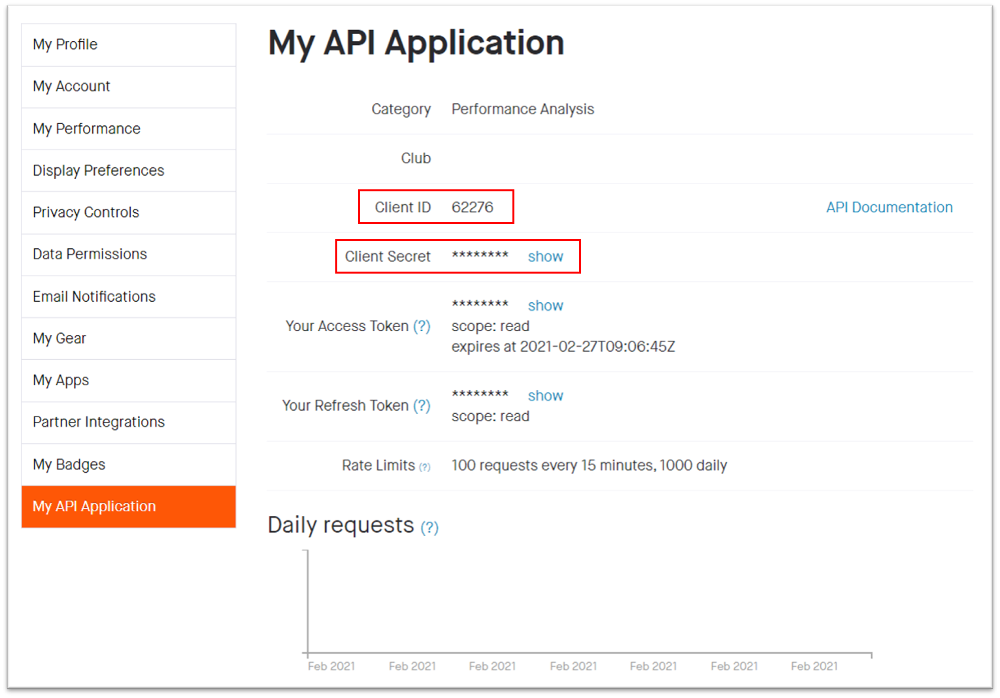

You will also see a refresh token on the same page. However, chances are that this token does not have the right permissions to access your activity data. So, we are going to have to obtain a proper refresh token for our use case.

Strava's authorisation code flow targets regular web and mobile applications. You can build a fully-fledged web application on Quix that utilises authorisation code flow. However, in this example, we are going to build a background service that fetches data from Strava and streams it on Quix without the intervention of a user. Therefore, implementing authorisation code flow on our side just to get one refresh token is a little excessive and we are going to sidestep that issue by manually obtaining the first refresh token using the following procedure.

 1. Replace `your_client_id` and `your_redirect_uri` (redirect uri should contain the same domain you used for authorisation callback domain. For instance, if you chose  `portal.platform.quix.ai` as your callback domain, a valid redirect uri would be  `https://portal.platform.quix.ai`) in the following url with the values from the API application we created. `https://www.strava.com/oauth/authorize?client_id=your_client_id&response_type=code&redirect_uri=your_redirect_uri&approval_prompt=force&scope=activity:read`. For our example, we need our access token to have the `activity:read` scope. Visit [Strava Authentication](https://developers.strava.com/docs/authentication/#requestingaccess) to view the list of supported scopes.
 2. Navigate to the above url using a web browser. You will be redirected to an authorisation page.
 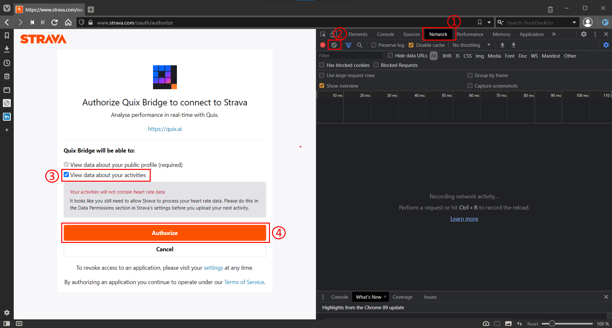\
 Ensure that the _View data about your activities_ option is checked and click on the _Authorize_ button.
 3. While you are being redirected to your redirect uri, you will see a url like `https://your_auth_callback_domain?state=&code=xxxxx&scope=read,activity:read` on your web browser's address bar. Take note of the value of the `code` query parameter.
 4. With the `code` you obtained in the preceding step, you can now generate a valid refresh token using the following HTTP request:

    ```
    curl --location --request POST 'https://www.strava.com/oauth/token?client_id=your_client_id&client_secret=your_client_secret&grant_type=authorization_code&code=your_code'
    ```
 5. Take note of the `refresh_token` in the response of the above request. For example, if you are using Postman, your request and response would look like
 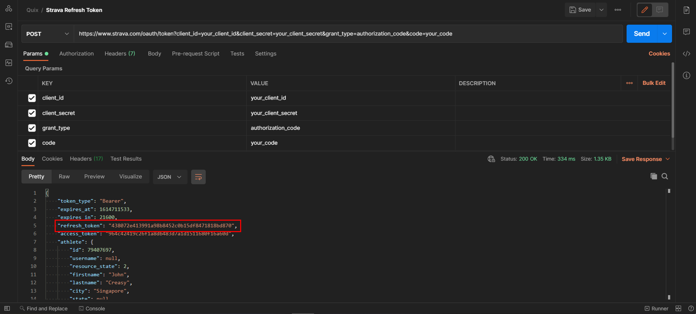

By now, you should have a valid client id, client secret and a refresh token for Strava.

## Obtain credentials for Quix

Since we are going to be writing our Strava data to a Quix stream, our service needs to authenticate itself to Quix using an access token. Obtaining an access token for Quix is far easier than what we had to do to generate an access token for Strava.

 1. Logon to Quix platform.
 2. Click on your profile icon and select _Profile_ to view your profile.
 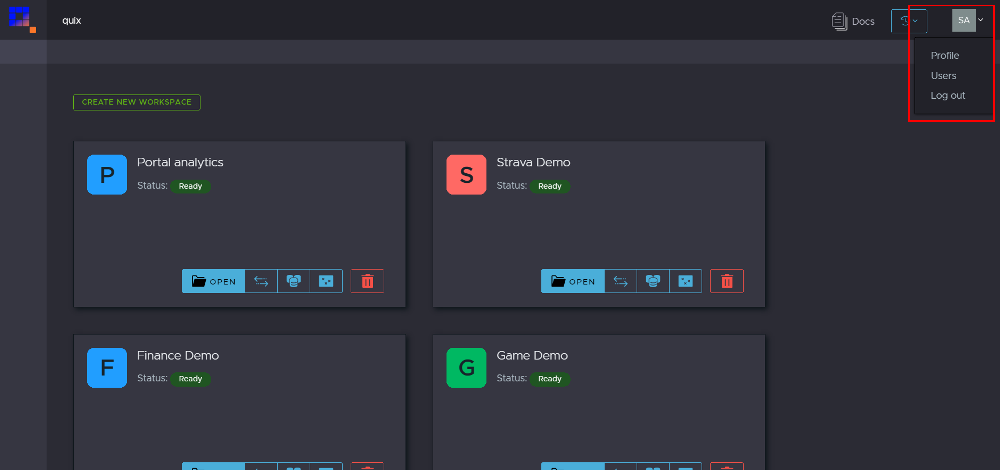
 3. Select _Personal Access Tokens_ tab and click on _Generate Token_ button.
 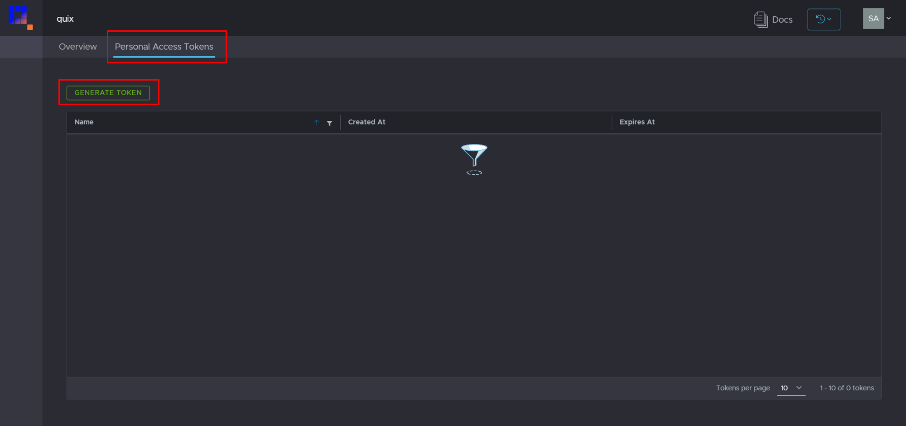
 4. Enter a token name and an expiration date for your personal access token (PAT) and click on _Create_.
 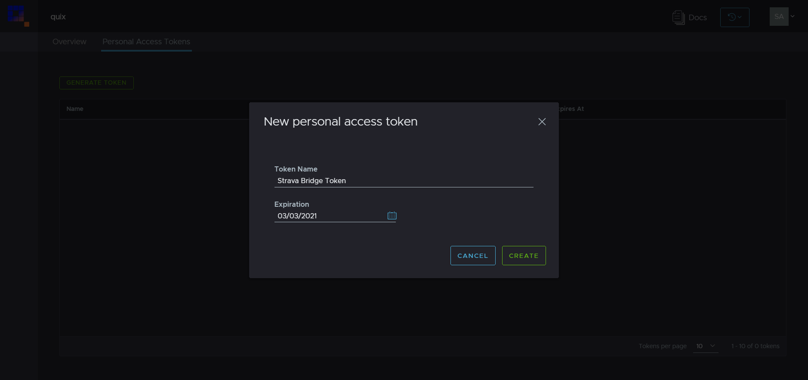
 5. Take note of the PAT because we are going to access Quix APIs using this access token.
 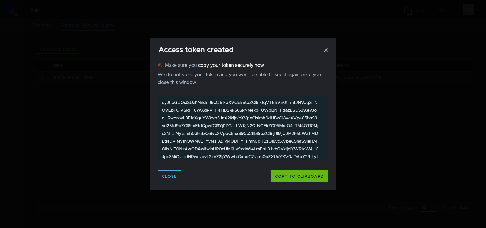

## Create a topic

Before we can write Strava data to a Quix stream, we need to create a topic to hold that stream. Navigate to your Quix workspace, select _Topics_ from the navigation panel and click on _Create Topic_ to create a topic. We are going to save our Strava data to persistent storage. So, throw the _Persistence_ switch to _ON_ for our topic after it has been created.

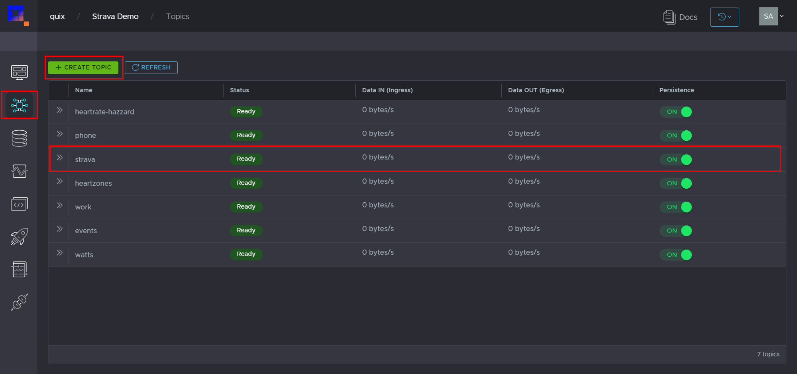

For more information on topics, please visit our [platform documentation](https://documentation-40c5b57b-a938-4925-93a9-25df5a64e54f.platform.quix.ai/topics/).

## Create a project

We can now build the service that will poll Strava for updates and stream them on Quix.

From your Quix workspace, click on _Library_ on the left navigation pane. Library is where we maintain code samples for popular use cases in the hope of reducing boilerplate work for you. Go to the _Sample projects_ tab, select your preferred language and "Strava.Bridge" from the project dropdown. Set the output topic to the one you created in the preceding section.

We are going to use C# for this example. At any rate, we don't expect you to do much coding for this example because we have done all the hard work for you.

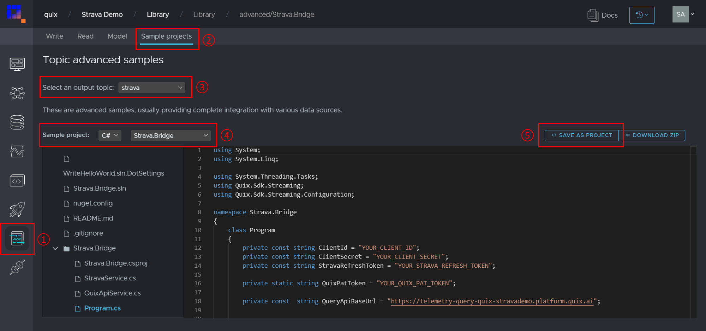

Once you have selected the topic, language and the Strava bridge project, click on _Save as project_ to create a project based on this template. You will be navigated to the _Develop_ tab where you will see the newly created project opened in our online code editor.

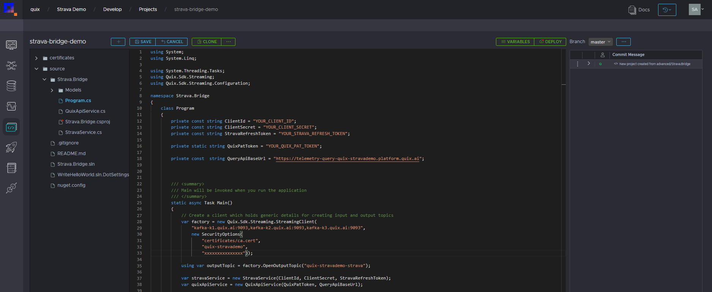

If you prefer to work in your own IDE, you can use our integrated git version control to clone the project to your local machine. Click on _Clone_ to generate the git url and the credentials. You can then work in your preferred development environment and commit changes to Quix as you would with any other git project.

## Update the code

Since all the heavy lifting has already been done for you, the only thing left to do is to supply the application with the credentials for Strava and Quix we generated in the previous sections.

Do you notice how tutorials out there often hard codes the credentials and leave a note about handling credentials more securely? Then you end up with a sample with hard-coded credentials, and you must rely on more service offerings from providers like key stores, bring in dependencies to connect to those key stores and a bunch of configuration files to inject the credentials to your application before you can produce anything that is remotely production-ready.

With Quix, those days are behind you. We, at Quix, believe that things as fundamental as configuring an application should not make us jump through hoops. Besides, what is wrong with doing things the right way from the beginning?

Open the _Program.cs_ (or equivalent in your chosen language) file in your project and select the following lines (lines 12-16).

```
private const string ClientId = "YOUR_CLIENT_ID";
private const string ClientSecret = "YOUR_CLIENT_SECRET";
private const string StravaRefreshToken = "YOUR_STRAVA_REFRESH_TOKEN";

private static string QuixPatToken = "YOUR_QUIX_PAT_TOKEN";
```
Replace the above lines with

```
private static readonly string ClientId = Environment.GetEnvironmentVariable("STRAVA_CLIENT_ID");
private static readonly string ClientSecret = Environment.GetEnvironmentVariable("STRAVA_CLIENT_SECRET");
private static readonly string StravaRefreshToken = Environment.GetEnvironmentVariable("STRAVA_REFRESH_TOKEN");

private static readonly string QuixPatToken = Environment.GetEnvironmentVariable("QUIX_ACCESS_TOKEN");
```
We will set those values at deployment time using a powerful Quix feature that allows us to interact with environmental variables easily. If you are using the Quix online code editor, all you need to do is save the file and the editor will commit your changes to git which you can see on the right-hand side of the editor.

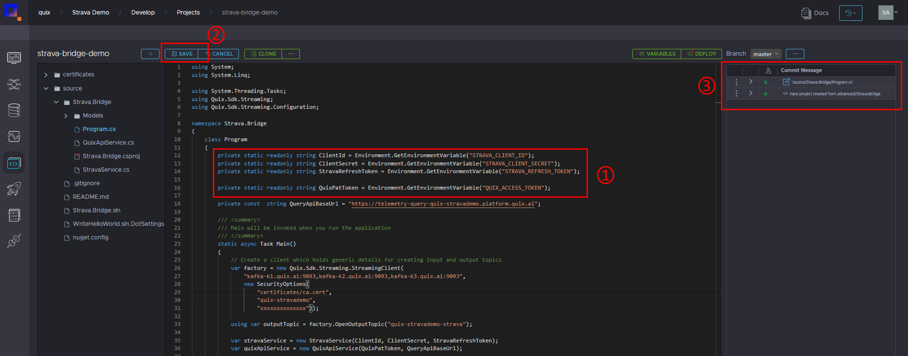

You can go through the rest of the code to understand what we are doing, but this is all the changes required to start streaming Strava data on Quix.

## Deploy code to Quix

Before we deploy our code to production, let us create a release tag for our new service. While this is optional, it is good practice as tags help you manage your releases especially when you start deploying updates.

If you are using the Quix code editor, click on the three dots next to the last commit (commits are on the right-hand side of the editor) and click on _Create Tag_, enter a name (e.g v1.0.0) and click on _Create_. You can achieve the same with whichever git client you are familiar with.

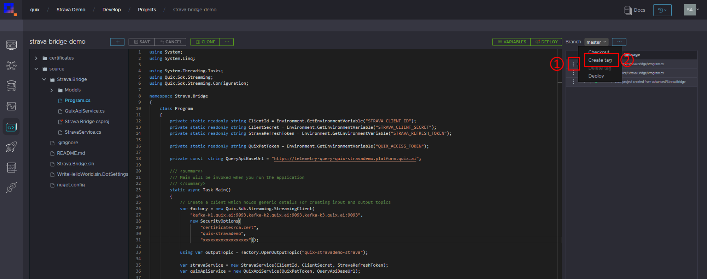

You can deploy the code either from within the online code editor by clicking on _Deploy_ button or by navigating to _Deployment_ page using the left navigation panel and clicking on _Create Deployment_. Both approaches will present you with a _New deployment_ dialog.

On the _General_ tab of the _New deployment_ dialog, change the name of your deployment if you like, select the project (the right project is likely already chosen for you) and select the version tag you just created. Change the deployment type to _Service_ to make sure that your application continues to run instead of shutting it down after one run (which is the case with _Jobs_). Set cpu to 450 millicores and memory to 500MB. We will stick to 1 replica in our example, but you can create high availability scenarios using more replicas in a production deployment.

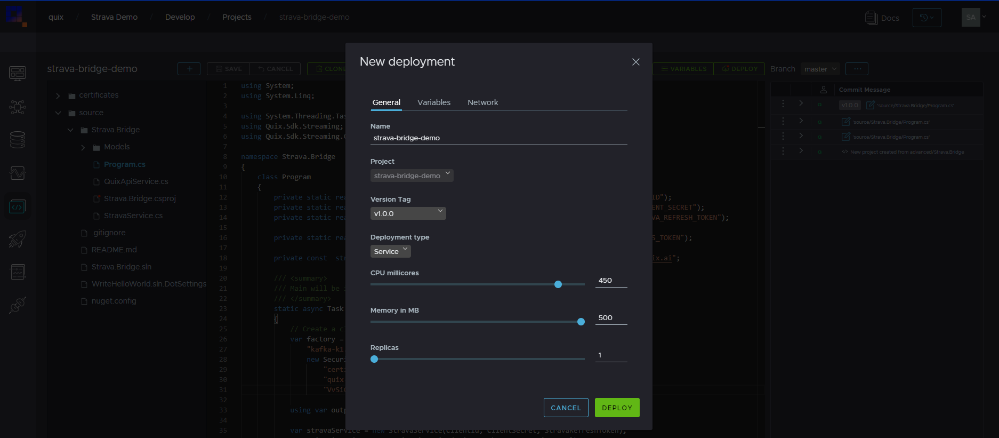

After you have configured the general settings for your deployment, click on the _Variables_ tab. This is where we will set our application credentials. Enter `STRAVA_CLIENT_ID` for the name of the variable and set the value to your Strava client id. To add more variables, click on the _Add_ button. Add variables `STRAVA_CLIENT_SECRET`, `STRAVA_REFRESH_TOKEN` and `QUIX_ACCESS_TOKEN`, and set their values to Strava client secret, Strava refresh token and Quix PAT you obtained at the beginning of this guide, respectively.

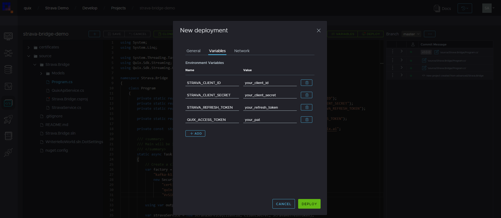

If you were building a fully-fledged web application, you could expose your service for public access using the configuration available on the _Network_ tab. However, we are not going to expose our modest background service to the public as that would serve no purpose.

Click on the _Deploy_ button to begin the deployment. Your new deployment will appear among the list of deployments along with live status updates. If you would like to see detailed logs of deployment, you can click on _Build logs_ next to the name of the deployment. To view application logs, click on _Logs_. If everything goes well, you will see the deployment status update to _Running_.

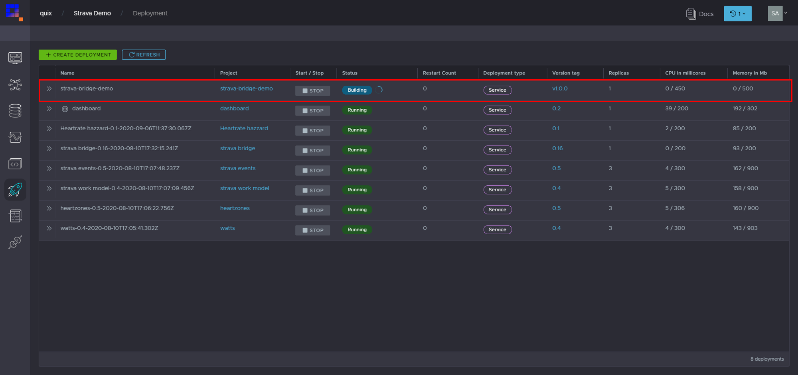

If you already have activities on your Strava account, you should be able to view their parameters like altitude, cadence, distance and heart rate using our [Visualize](https://documentation-40c5b57b-a938-4925-93a9-25df5a64e54f.platform.quix.ai/visualise/) feature. Otherwise, take your Strava device out and go get some exercise!

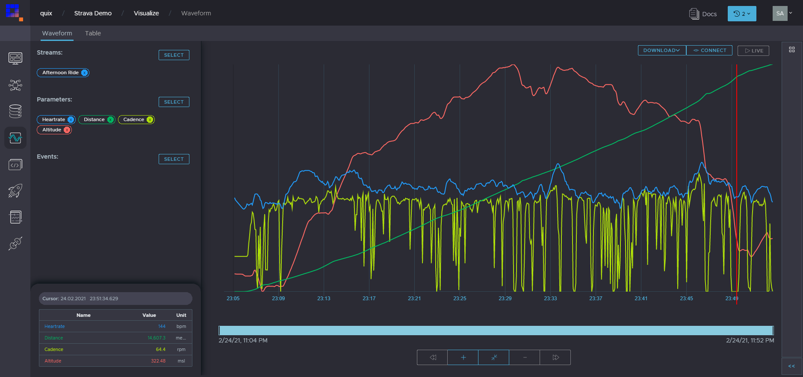

## Next steps

The motivation behind streaming Strava data on Quix is that you can perform near real-time advanced analytics on your activities rather than leaving them be on Strava. Now that your activities are streaming on Quix, you can create a whole symphony of services using our powerful [SDKs](https://documentation-40c5b57b-a938-4925-93a9-25df5a64e54f.platform.quix.ai/sdk/csharp-how-to/) to read from the topic that contains your raw activity data, analyse them, and write the results to new topics/streams. You can also expose the results of your models through live mobile and web applications powered by Quix!
